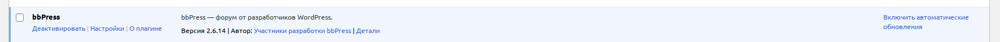

# 🐾 Доктор Хвост

**Ветеринарная клиника — помощь и забота о ваших питомцах**

---

*Учебная практика (ПМ.02) · Специальность: 09.02.07 Информационные системы и программирование · Усть-Лабинский социально-педагогический колледж*

**Руководитель:** Граков Дмитрий Витальевич

---

## 📌 О проекте

«Доктор Хвост» — это сайт ветеринарной клиники, созданный для владельцев домашних животных.

### Возможности сайта

| Раздел | Описание |
|--------|----------|
| 🩺 Услуги и цены | Ветеринарные услуги, анализы, прививки |
| 👨‍⚕️ Врачи | Опытные ветеринары с профилями |
| 📚 Полезные статьи | Советы по здоровью и уходу |
| 📞 Обратная связь | Запись на приём через форму |
| 💬 Форум | Общение владельцев животных |

### Технологии

`LAMP` · `WordPress` · `GitHub` · `Contact Form 7` · `bbPress`

---

## 💬 Форум

На сайте установлен форум **bbPress** для общения владельцев домашних животных.

### Статистика

| Показатель | Значение |
|------------|----------|
| Форумов | 1 |
| Категорий | 3 |
| Тем | 6 |
| Сообщений | 6 |

### Категории форума

| | Категория | Описание |
|--|-----------|----------|
| 🩺 | Здоровье и болезни | Лечение, симптомы, профилактика |
| 🐾 | Уход и содержание | Питание, гигиена, воспитание |
| 🚑 | Первая помощь | Экстренные ситуации до визита к врачу |

---

## 📸 Скриншоты

### 1. Установка плагина

### 2. Главная страница форума

### 3. Категория «Здоровье и болезни»

### 4. Категория «Уход и содержание»

### 5. Категория «Первая помощь»

### 6. Правила форума

---

## 🔗 Ссылки

| | |
|--|--|
| 🌐 **Сайт** | `http://10.40.40.184` |
| 💬 **Форум** | `http://10.40.40.184/?forum=Главный-форум` |
| 📜 **Правила форума** | `http://10.40.40.184/?topic=Правила-форума-ветеринарной-клиники` |

---

## ✅ Результаты тестирования

📄 Файл **`TESTING.md`** содержит полные результаты тестирования форума.

| Что проверялось | Результат |
|----------------|-----------|
| Установка плагина | ✅ |
| Создание форума | ✅ |
| Создание категорий (3 шт.) | ✅ |
| Создание тем (6 шт.) | ✅ |
| Создание сообщений (6 шт.) | ✅ |
| Отображение форума | ✅ |
| Добавление в меню | ✅ |
| Страница правил | ✅ |

---

## 👩‍💻 Автор

| | |
|--|--|
| **ФИО** | Куксенко |
| **Группа** | ИС 21 |

---

© 2026 Доктор Хвост · Все права защищены
